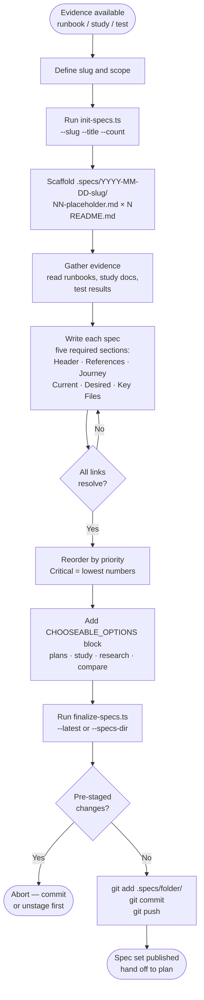

# specs
Produces investigation-ready developer briefs that link observed behavior to source-code entry points. It bridges runbook findings, study outputs, or test results into numbered spec files under `.specs/`, then hands off to `plan` for implementation execution.

## Install

The fastest cross-agent install path is the `skills` CLI:

```bash
npx skills add gg-skills/specs
```

Drop this skill into a workspace as a Git submodule for pinned versions, or as a plain clone for latest `main`:

```bash
# Project-local, version-pinned:
git submodule add git@github.com:gg-skills/specs.git .claude/skills/specs

# OR project-local, latest main:
mkdir -p .claude/skills
git -C .claude/skills clone git@github.com:gg-skills/specs.git

# OR user-level, available in every project on this machine:
mkdir -p ~/.claude/skills
git -C ~/.claude/skills clone git@github.com:gg-skills/specs.git
```

Restart your agent or reload skills after installation. See the parent [`skills` catalog repo](https://github.com/gg-skills/skills) for the full catalog.

## When to use

- A study, runbook, or audit produces findings that need breaking into discrete, actionable developer briefs.
- Browser tests, pipeline audits, or log analysis reveal multiple related issues to track as numbered specs.
- The user asks to convert observations into structured specs with source-code entry points and user-journey diagrams.
- Codex session analysis identifies patterns that deserve per-issue investigation briefs.

Do **not** use when the fix is a single file change with a known location, when only a high-level plan is needed (use `plan` directly), or when observations are purely speculative with no concrete evidence.

## How it operates

### Inputs

| Source | Detail |
|--------|--------|
| Runbook documents | Markdown files containing browser-test steps, log excerpts, or audit observations. Read by the agent to populate Runbook References sections. |
| Study or research outputs | Markdown files from `study` or `research-online`. |
| Test results / screenshots | Any concrete evidence file referenced during spec writing. |
| `--slug` (required) | Kebab-case identifier for the spec set; becomes the folder name suffix. |
| `--title` | Human-readable heading for the spec bundle README. Defaults to `Specs: <slug>`. |
| `--count` | Number of placeholder spec files to scaffold (1–50). Defaults to `1`. |
| `--date` | Override date in `YYYY-MM-DD` format. Defaults to the local runtime date. |
| `--root` | Repository root override. Defaults to `process.cwd()`. |
| `--dry-run` | Preview mode; skips all disk writes and git operations. |
| `--specs-dir` | Relative path to an existing spec folder, used by `finalize-specs.ts`. |
| `--latest` | Tells `finalize-specs.ts` to pick the most recently named folder under `.specs/`. |
| `--commit-message` | Override the auto-generated commit message in `finalize-specs.ts`. |

### Outputs

| Path | Format | Producer |
|------|--------|----------|
| `.specs/YYYY-MM-DD-<slug>/NN-<topic>.md` | Markdown spec file with five required sections | Agent + `init-specs.ts` |
| `.specs/YYYY-MM-DD-<slug>/README.md` | Index table, cluster analysis, and implementation order | `init-specs.ts` |
| stdout (JSON) | `{ dryRun, specsRoot, specsDir, specFiles, readmePath, slug, date, count }` from init; `{ dryRun, repoRoot, branchName, specsDir, specCount, commitMessage, pushed }` from finalize | scripts |

### External commands

| Command | When called | Purpose |
|---------|-------------|---------|
| `npx tsx scripts/init-specs.ts` | Start of a spec session | Scaffolds the dated folder with N numbered placeholder files and a README |
| `npx tsx scripts/finalize-specs.ts` | End of a spec session | Stages the spec folder, commits with an auto-generated message, and pushes |
| `git add -- <relative-path>` | Inside `finalize-specs.ts` | Stages only the spec directory, nothing else |
| `git commit -m <message>` | Inside `finalize-specs.ts` | Creates a scoped commit (`specs(ux): publish <folder> (N specs)`) |
| `git push` | Inside `finalize-specs.ts` | Publishes to the current remote branch |
| `npm run skills:sync` | After SKILL.md edits | Propagates skill file changes to IDEs |

### Side effects

- Creates `.specs/YYYY-MM-DD-<slug>/` directory tree on disk (skipped in `--dry-run`).
- Stages and commits changes to the repository; pushes to the current branch's remote.
- Refuses to run if there are pre-existing staged changes (guards against mixed commits).
- Throws if the spec folder already exists (`init-specs.ts`) or if no `NN-*.md` files were staged (`finalize-specs.ts`).
- Validates that staged files are strictly within the spec folder scope before committing.

### Mode toggles

| Flag | Effect |
|------|--------|
| `--dry-run` | No disk writes, no git operations; stdout JSON still printed |
| `--latest` | `finalize-specs.ts` auto-selects the newest folder under `.specs/` by lexical sort (descending) |

## Operational flow



## Layout

```
specs/
├── SKILL.md                    # Skill definition and full workflow
├── README.md                   # This file
├── agents/                     # Agent-specific guidance files
├── assets/                     # Static assets
├── references/
│   └── spec-template.md        # Required five-section template for individual specs
└── scripts/
    ├── init-specs.ts           # Scaffold a dated spec folder with placeholder files
    └── finalize-specs.ts       # Stage, commit, and push the completed spec folder
```

## Quick start

```bash
# 1. Scaffold three placeholder specs for a new investigation
npx tsx .claude/skills/specs/scripts/init-specs.ts \
  --slug "thread-creation-ux" --title "Thread Creation UX" --count 3

# 2. Fill in the generated files under .specs/YYYY-MM-DD-thread-creation-ux/

# 3. Preview what finalize would do
npx tsx .claude/skills/specs/scripts/finalize-specs.ts \
  --specs-dir "2026-05-17-thread-creation-ux" --dry-run

# 4. Commit and push
npx tsx .claude/skills/specs/scripts/finalize-specs.ts --latest
```

## Resources

- `references/spec-template.md` — canonical five-section template with field-level rules.
- `SKILL.md` — full workflow, non-negotiable policy, cross-skill handoffs, and troubleshooting table.
- `plan` — downstream skill for converting a completed spec set into an execution plan.
- `study` — upstream skill for deep-dive analysis that feeds evidence into specs.
- `research-online` — upstream skill for external best-practice research that informs spec findings.

## Caveats

- Specs require concrete evidence (runbook docs, study findings, or test results). Do not create specs from speculation alone.
- The finalize script stages **only** files inside the target spec folder. Keep unrelated changes unstaged before running it.
- Number specs in priority order: Critical issues get the lowest numbers, not discovery order.
- All paths inside spec files must be repository-relative. Absolute paths will break portability.
- Every spec set must end with a `CHOOSEABLE_OPTIONS` block before finalizing — the finalize script does not enforce this but the skill policy does.
- The `--date` override exists for backfill scenarios; omit it in normal use to let the script date the folder automatically.
